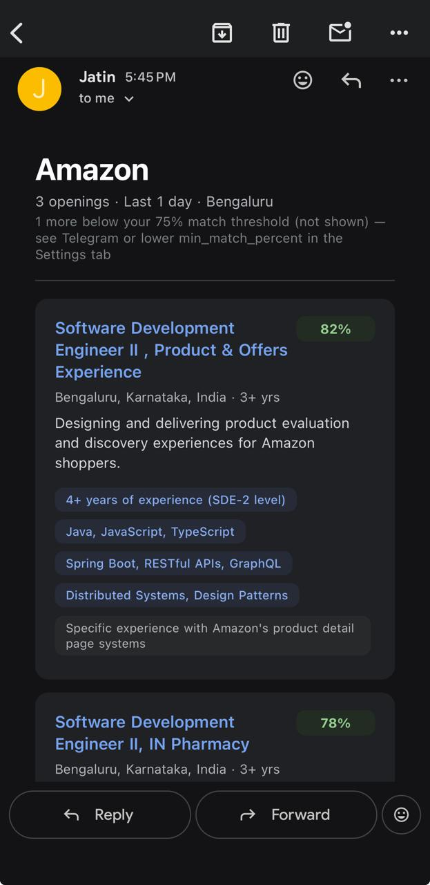

# LinkedIn Job Search Automation

**Wake up to a short list of fresh openings at the companies you care about — already scored against your resume.**

This project watches LinkedIn for new roles at a list of target companies, drops the ones that don't fit (wrong seniority, wrong city, too much experience required), asks an AI how well each remaining role matches *your* resume, and sends the results to your phone on Telegram. It runs on its own, several times a day, and never sends you the same job twice.

It's built with [n8n](https://n8n.io) (a visual workflow tool), Google Sheets (where you keep your settings), and Gemini (free-tier AI). You don't need to write code to use it.

<br>


<br>

[Detailed architecture →](https://jatin17solanki.github.io/linkedin_automation/)

## What you get

### 1. A scheduled job digest — from Bot #1

By default it runs **eight times a day** — and you can change that to whatever times suit you ([how](SETUP_GUIDE.md#55-schedule-and-time-window)). Each run sends **one message to your Telegram chat** listing everything new, best match first. Bot #1 posts to the chat ID you configure, and that same chat is where you message it commands such as `/jobs 6` (the number is **hours**: "search the last 6 hours now"). 🟢 is a strong match, 🟡 a decent one, 🔴 a long shot.

<p align="center"></p>

That is real output: `/jobs 48` searched the last 48 hours, and each opening shows its match %, company, title, required experience, location and link. Nothing new? You get a one-line "ran fine, no new openings" so you know it's alive. If the AI is unavailable one run, you still get the list, unscored, with a warning.

### 2. An on-demand company lookup — from Bot #2 (recommended)

Curious about one company right now? Message the second bot — the number at the end is **days** (default 7, anywhere from 1 to 90):

<p align="center"></p>

Real output again: `/search Amazon 1` looked at Amazon's openings from the last **1 day**. It also emails you a fuller report: a one-line summary of each role, the skills you match, and the gaps. (Partial names work — `/search clear` finds ClearTrip and ClearTax.)

**Why it's worth setting up:**

- **Look at any company, any time**, for any window from 1 to 90 days — before you apply, or for companies that post rarely and hardly ever show up in a digest.
- **Your digest list doesn't limit it.** A company set to `Active = FALSE` in your Sheet stays out of the scheduled digest but is still searchable here, so you can keep a long Config list and switch on only the companies you want pushed to you.
- **It shows everything in the window**, not just what's new since the last digest.
- **The email report tells you *why* a role matches** and where the gaps are, which helps you decide whether to apply.
- It needs a cloud VM (see [Choose your setup](#choose-your-setup)) — one more reason to go cloud.

The email report for that same search:

<p align="center"></p>

### 3. A LinkedIn job parser for Claude — optional

A tiny web address that turns any LinkedIn job link into clean structured data, plus an MCP server so **Claude** can call it directly ("parse this job for me").

### Why two Telegram bots?

Telegram sends a bot's incoming commands to exactly one place. The scheduled digest (`/jobs`) and the company lookup (`/search`) each need to receive their own commands, so each gets its own bot:

| | Bot #1 | Bot #2 |
|---|---|---|
| **Workflow** | Job Search | Company Search |
| **Does** | Sends the digests; on a cloud VM also answers `/jobs 6` (last 6 **hours**) | Answers `/search Oracle 30` (last 30 **days**) |
| **Needed?** | Yes | **Recommended** (you can add it later) |

**The two commands, side by side.** They take different units:

| Command | The number is… | Example | If you leave it out | Allowed |
|---|---|---|---|---|
| `/jobs N` — Bot #1 | **hours** | `/jobs 6` → the last 6 hours | 12 hours | any whole number |
| `/search Company N` — Bot #2 | **days** | `/search Oracle 30` → the last 30 days | 7 days | 1 to 90 |

Type just the number: `/jobs 6h` and `/search Oracle 30d` don't work. As a rule of thumb, **hours** answer "what's new since I last checked?" and **days** answer "what has this company posted lately?".

Creating a bot takes a minute — the [setup guide](SETUP_GUIDE.md#12-telegram-bots) walks through it.


## The three workflows

| Workflow | Triggered by | Gives you | Works locally? |
|----------|--------------|-----------|:---:|
| **Job Search** | A schedule (8×/day), or `/jobs N`, or a local webhook | The scheduled digest, logged to your Sheet | ✅ (scheduled + manual) |
| **Company Search** | `/search Company [days]` on Telegram | On-demand lookup + email report | ❌ needs a cloud VM |
| **Job Parser** | A web request | Structured JSON for one job URL | ✅ |

The first is the core. **We recommend Company Search too** — it's what you'll reach for whenever you want to look at one company right now. Job Parser is a niche extra. All three are already inside the project and stay dormant until you turn them on.

## Features

- **Config-driven** — your companies, city, experience range and match threshold live in a Google Sheet you edit in a browser. No code, no restarts.
- **Smart filtering** — drops staff/principal/manager/QA/devops roles, other cities, and roles asking for more experience than your target range.
- **AI matching** — Gemini scores each role against your resume (skills 40%, experience 30%, domain 20%, seniority 10%). Optionally hide anything below a match % you choose.
- **Complete results** — reads every page LinkedIn returns for a search (up to 300 per company group per run), not just the first page.
- **No repeats** — remembers every job it has shown you.
- **Gentle on LinkedIn** — waits between requests; it reads only public job pages.
- **Graceful** — if the AI fails you still get your list.
- **Multi-city** — search one city or several at once.

## Privacy and cost

**You run it, you own it.** The software is free and open source (MIT). It runs on a machine you control — your own computer or your own cloud VM — with no account, hosted service or analytics from the author. Your company list, settings, resume summary and job history live in a Google Sheet **you** own (keep it private — never "anyone with the link"), and nothing is sent to the author. Your bots also only answer **your** Telegram chat (the chat ID you configure): a bot's username is public, but messages from anyone else who finds it are silently ignored.

**What does leave your setup — worth knowing:**

- **Gemini (the AI scoring).** Each job description and your resume summary are sent to Google's Gemini API. On the **free tier**, Google's terms say it may use that content to improve its products and that human reviewers may read it ([terms](https://ai.google.dev/gemini-api/terms)) — which is why the resume prompt leaves out your phone, email and links. If that isn't acceptable to you, use a **paid** Gemini key (the same terms say paid usage isn't used to improve Google's products) or leave the key blank and get unscored lists.
- **Telegram and Gmail** carry the messages and the email you asked for. **LinkedIn** sees ordinary requests for public job pages from your server's address. This is an unofficial approach: LinkedIn's terms restrict automated access, so use it for your own job search, keep the schedule modest, and expect it to need repairs if LinkedIn changes its pages.
- **n8n's own telemetry.** Stock n8n sends anonymous usage data and version checks by default. This project's Docker Compose files switch both off (`N8N_DIAGNOSTICS_ENABLED=false`, `N8N_VERSION_NOTIFICATIONS_ENABLED=false`). A VM you set up earlier keeps its old compose file until you update it — see [Updating an existing instance](SETUP_GUIDE.md#62-updating-an-existing-instance).

**Cost:** the software and Gemini's free tier cost nothing. The always-on VM is free for a while (AWS: a 6-month plan for new accounts; GCP: free indefinitely once you upgrade out of the trial) and then a few dollars a month — see [Costs](SETUP_GUIDE.md#63-costs). Running it on your own computer is free.

## Choose your setup

You need somewhere for n8n to run. Three options:

| | **Your own computer** | **AWS EC2** ⭐ recommended | **GCP** |
|---|---|---|---|
| **Best for** | Trying it out before committing | Running it 24/7 | Running it 24/7 (if you already use GCP) |
| **Cost** | Free | New accounts get a **6-month Free plan** (up to $200 credit), then normal hourly pricing — a few dollars a month | Free indefinitely, *but only after upgrading out of the 90-day trial* — otherwise it's suspended |
| **Runs when your computer is off?** | ❌ | ✅ | ✅ |
| **Scheduled digests** | ✅ only while your computer and Docker are on | ✅ | ✅ |
| **`/jobs` and `/search` from your phone** | ❌ | ✅ | ✅ |
| **Company Search + email report** | ❌ | ✅ | ✅ |
| **Job Parser / Claude tool** | ✅ | ✅ | ✅ |
| **Status in this project** | Tested | **Tested end to end** | Ran in production originally; the rewritten setup script hasn't been re-run on a fresh VM yet |

**What doesn't work on your own computer:** anything you trigger by *messaging a bot*. Telegram delivers commands to a public HTTPS address, which a laptop doesn't have. So the `/jobs N` command and the entire Company Search workflow need a cloud VM. The scheduled digest works locally — but only while your machine is running.

**Our advice:** if you just want to see it work, start locally; when you like it, move to **AWS** for the always-on version. If you're already sure you want it running around the clock, go straight to AWS. (Everything you set up — your Sheet, bots and keys — carries over.)

## Get started

Everything is in the **[Setup Guide](SETUP_GUIDE.md)**. It starts with a checklist so you gather every key and account *first* and never have to stop halfway.

### Two "optional" steps we recommend

Both can be skipped, but both make the project far more useful:

1. **Load your real resume.** Every match % is computed against whatever is in your Sheet's Resume tab, so it has to hold your actual details — otherwise the scores, the ordering and the `min_match_percent` filter mean little. The Setup Guide gives you a prompt that turns your resume into the right format with one paste ([Step 1.4](SETUP_GUIDE.md#14-your-google-sheet-and-your-resume)).
2. **Set up Company Search (Bot #2).** It adds on-demand `/search` lookups and the email report ([Step 4.1](SETUP_GUIDE.md#41-company-search-search)). Cloud only.

**Index**

- **[Part 1 — Before you start](SETUP_GUIDE.md#part-1-before-you-start--gather-everything-first)** — the checklist
  - [Create your Telegram bot(s)](SETUP_GUIDE.md#12-telegram-bots) · [Get a Gemini key](SETUP_GUIDE.md#13-gemini-api-key) · [Build your Google Sheet & load your resume](SETUP_GUIDE.md#14-your-google-sheet-and-your-resume) · [Google OAuth client](SETUP_GUIDE.md#15-google-cloud-oauth-client)
- **[Part 2 — Run n8n](SETUP_GUIDE.md#part-2-run-n8n)** — [locally](SETUP_GUIDE.md#2a-locally-with-docker) · [AWS](SETUP_GUIDE.md#2b-on-aws-ec2-recommended-for-cloud) · [GCP](SETUP_GUIDE.md#2c-on-gcp)
- **[Part 3 — Connect n8n to your accounts](SETUP_GUIDE.md#part-3-connect-n8n-to-your-accounts)**
- **[Part 4 — Optional workflows](SETUP_GUIDE.md#part-4-the-optional-workflows)** — [Company Search](SETUP_GUIDE.md#41-company-search-search) · [Job Parser + Claude](SETUP_GUIDE.md#42-job-parser--mcp-server)
- **[Part 5 — Customizing](SETUP_GUIDE.md#part-5-customizing)** — [companies & buckets](SETUP_GUIDE.md#51-companies-and-buckets) · [title filters](SETUP_GUIDE.md#52-title-filters) · [location & multiple cities](SETUP_GUIDE.md#53-location-and-multiple-regions) · [experience range](SETUP_GUIDE.md#54-experience-range) · [schedule](SETUP_GUIDE.md#55-schedule-and-time-window)
- **[Part 6 — Operations](SETUP_GUIDE.md#part-6-operations)** — [updating](SETUP_GUIDE.md#62-updating-an-existing-instance) · [costs](SETUP_GUIDE.md#63-costs) · [optional CI/CD](SETUP_GUIDE.md#61-optional-github-actions-cicd)
- **[Troubleshooting](TROUBLESHOOTING.md)** — known problems and fixes

### The short version

```bash
# Cloud VM (Ubuntu 22.04): after Part 1's checklist, this one script does the server work
git clone https://github.com/Jatin17Solanki/linkedin_automation.git && cd linkedin_automation
sudo bash deploy/setup-aws.sh     # or deploy/setup-gcp.sh on GCP
# then open https://<VM_IP>.nip.io and connect your accounts (Part 3)

# Or locally, with Docker running:
docker compose up -d --build      # then open http://localhost:5678
```

## Stuck? Let an AI assistant walk you through it

Setup means a lot of small steps across several websites. If you find it hard to navigate on your own, open an AI coding assistant (Claude Code, Cursor, Copilot — any that can read files) in a copy of this repo and tell it:

> Read `CLAUDE.md`, then help me set this up. I want to run it on **[my computer / AWS / GCP]**.

[`CLAUDE.md`](CLAUDE.md) is written for exactly that. It tells the assistant to follow the same order as the Setup Guide, what it can and can't do for you, and how the project works — so it can also help you troubleshoot and customize afterwards. (Claude Code loads it automatically; with other assistants, ask them to read it.)

Two habits help: **don't paste secrets** (bot tokens, API keys, OAuth secrets) into a chat — a good assistant tells you *where* each one goes instead — and when something fails, share the **error message or the n8n execution output** so it can diagnose rather than guess.

## How the search is tuned

You don't have to touch any of this to get started — the defaults are Bengaluru, roles asking for up to 4 years, and 94 pre-loaded companies. When you're ready:

- **Adding companies.** Your Sheet's Config tab *is* the list, and the 94 pre-loaded companies are only a starting point. To add one: (1) find its LinkedIn company ID — on LinkedIn Jobs use the **Company** filter and read `f_C=` from the address bar; (2) add a row with the name and that ID; (3) set **Bucket to 4** unless you know better; (4) `Active = TRUE` to include it in the scheduled digest, or `FALSE` to keep it searchable only through `/search`. Takes effect on the next run, no restart. [Step by step →](SETUP_GUIDE.md#51-companies-and-buckets)
- **Buckets.** Each company sits in one of four "buckets" that decide how it's searched (companies label the same level differently — "SDE II", "Level 3", plain "Software Engineer"). New company? Bucket 4. [Why buckets exist →](SETUP_GUIDE.md#51-companies-and-buckets)
- **Title filters.** Staff, principal, manager, QA, devops and similar are dropped automatically; "senior" is dropped only where it really means a step up. [Where and how to change →](SETUP_GUIDE.md#52-title-filters)
- **Location.** Bengaluru by default; any city or several at once, set in the Sheet. [Finding a city's code →](SETUP_GUIDE.md#53-location-and-multiple-regions)
- **Experience.** You give a bracket like "3 to 5 years"; a role is kept if its own range overlaps yours. Permissive on purpose: better one extra role to glance at than a good one silently missed. [Details →](SETUP_GUIDE.md#54-experience-range)
- **Schedule.** Eight runs a day by default. [Change the times →](SETUP_GUIDE.md#55-schedule-and-time-window)

## Claude / MCP server

`mcp-server/` is a small Node.js server that lets Claude call the Job Parser as a `parse-linkedin-job` tool. Setup: [Setup Guide, Part 4](SETUP_GUIDE.md#42-job-parser--mcp-server).

## What's in the repo

```
n8n_job_search_v1.json      # Job Search workflow (scheduled digest)
n8n_company_search_v1.json  # Company Search workflow (/search)
n8n_job_parser_v1.json      # Job Parser webhook
mcp-server/                 # MCP server for Claude
examples/google-sheet/      # bootstrap script + templates for your Google Sheet
Dockerfile, docker/         # image that auto-loads the 3 workflows on first start
deploy/                     # one-shot setup scripts for AWS/GCP, Docker Compose, Caddy (HTTPS)
SETUP_GUIDE.md              # the walkthrough
TROUBLESHOOTING.md          # known problems and fixes
CONTRIBUTING.md             # how to contribute (and the rules that matter)
BACKLOG.md                  # what's planned, what's unverified, what will rot first
CLAUDE.md                   # technical reference, written for AI coding assistants
scripts/check-secrets.js    # run before committing: catches leaked tokens and real ids
LICENSE                     # MIT
```

## Contributing

Issues and pull requests are welcome — [`CONTRIBUTING.md`](CONTRIBUTING.md) has the few rules that matter (chiefly: never commit real personal data), and [`BACKLOG.md`](BACKLOG.md) lists what's planned and what's still unverified.

## License

[MIT](LICENSE). That covers the files in this repository; [n8n](https://n8n.io), which the workflows run on, is licensed separately by its authors.

---

<p align="center">
  <strong>Built by Jatin</strong><br>
  Questions, ideas, or something not working? Email me at
  <a href="mailto:jatin.dev.17@gmail.com">jatin.dev.17@gmail.com</a><br>
  <a href="https://github.com/Jatin17Solanki/linkedin_automation/issues">Open an issue</a> ·
  <a href="https://github.com/Jatin17Solanki">GitHub</a>
</p>
