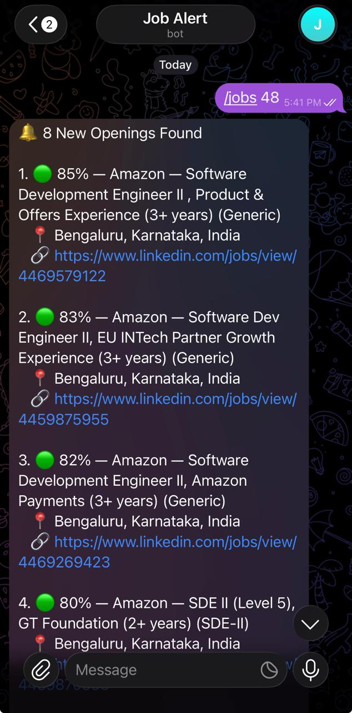
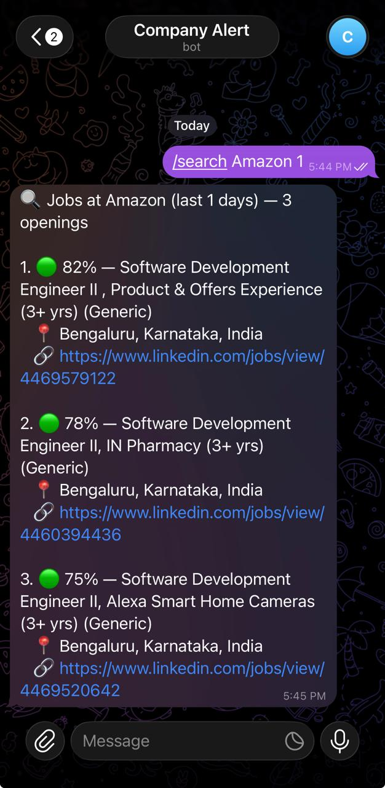

# Setup Guide

This guide takes you from nothing to a running job-search bot. If you haven't yet, read the [README](README.md) first — it explains what the project does and helps you choose between running it on your own computer, on AWS, or on GCP. This guide is the step-by-step walkthrough once you've chosen.

**How it's organised — and why the order matters.** [Part 1](#part-1-before-you-start--gather-everything-first) has you collect every key, token and account *before* you touch a server. That is deliberate: the setup script and n8n each ask for things at specific moments, and you shouldn't have to stop halfway to go and fetch an API key. By the time you reach Part 3 you'll have everything in one place.

## Contents

- **[Part 1: Before you start — gather everything first](#part-1-before-you-start--gather-everything-first)**
  - [1.1 The checklist](#11-the-checklist)
  - [1.2 Telegram bots](#12-telegram-bots)
  - [1.3 Gemini API key](#13-gemini-api-key)
  - [1.4 Your Google Sheet (and your resume)](#14-your-google-sheet-and-your-resume)
  - [1.5 Google Cloud OAuth client](#15-google-cloud-oauth-client)
  - [1.6 Decide your search settings](#16-decide-your-search-settings)
- **[Part 2: Run n8n](#part-2-run-n8n)**
  - [2A Locally with Docker](#2a-locally-with-docker)
  - [2B On AWS EC2 (recommended for cloud)](#2b-on-aws-ec2-recommended-for-cloud)
  - [2C On GCP](#2c-on-gcp)
- **[Part 3: Connect n8n to your accounts](#part-3-connect-n8n-to-your-accounts)**
- **[Part 4: The optional workflows](#part-4-the-optional-workflows)** — [Company Search](#41-company-search-search), [Job Parser + MCP](#42-job-parser--mcp-server)
- **[Part 5: Customizing](#part-5-customizing)** — [companies & buckets](#51-companies-and-buckets), [title filters](#52-title-filters), [location & multiple regions](#53-location-and-multiple-regions), [experience](#54-experience-range), [schedule](#55-schedule-and-time-window), [environment variables](#56-environment-variable-reference)
- **[Part 6: Operations](#part-6-operations)** — [optional CI/CD](#61-optional-github-actions-cicd), [updating an existing instance](#62-updating-an-existing-instance), [costs](#63-costs), [maintenance commands](#64-maintenance-commands), [troubleshooting](#65-troubleshooting)

---

# Part 1: Before you start — gather everything first

Nothing in this part touches a server. It's all accounts, keys and a spreadsheet. Do it once, calmly, and the rest of the guide is mostly pasting.

## 1.1 The checklist

Tick these off before starting Part 2. "Local" means n8n running on your own computer; "Cloud" means an AWS or GCP VM. Details for each are in the sections named in the last column.

| # | You need | What it's for | Local | Cloud | Where |
|---|----------|---------------|:-----:|:-----:|-------|
| 1 | **Telegram bot #1** (token) | Sends you the job digests | ✅ | ✅ | [1.2](#12-telegram-bots) |
| 2 | **Your Telegram chat ID** | Tells the bot *where* to send them | ✅ | ✅ | [1.2](#12-telegram-bots) |
| 3 | **Gemini API key** | Scores each job against your resume (match %). Optional — without it you get plain, unscored notifications | ✅ | ✅ | [1.3](#13-gemini-api-key) |
| 4 | **Your own Google Sheet**, created by the bootstrap script | Your company list, settings, resume and job history live here | ✅ | ✅ | [1.4](#14-your-google-sheet-and-your-resume) |
| 5 | **Your resume as JSON** — *recommended* | Fills the Sheet's Resume tab; every match % is scored against it | ✅ | ✅ | [1.4](#14-your-google-sheet-and-your-resume) |
| 6 | **Google OAuth Client ID + Secret** | Lets n8n read and write your Sheet | ✅ | ✅ | [1.5](#15-google-cloud-oauth-client) |
| 7 | **Telegram bot #2** (token) — *recommended: it powers Company Search* | Answers your `/search` commands | ❌ cloud only | ✅ | [1.2](#12-telegram-bots) |
| 8 | **Gmail API enabled** — *for Company Search's email report (recommended)* | Emails you the detailed report | ❌ cloud only | ✅ | [1.5](#15-google-cloud-oauth-client) |
| 9 | **An AWS or GCP account** | Hosts the always-on VM | — | ✅ | [2B](#2b-on-aws-ec2-recommended-for-cloud) / [2C](#2c-on-gcp) |
| 10 | **A username and password you'll choose** for the n8n web page | The setup script asks for these; they aren't shown again | — | ✅ | [2B](#2b-on-aws-ec2-recommended-for-cloud) / [2C](#2c-on-gcp) |
| 11 | **Your search preferences**: companies, location, experience range | Decide now; you can change them any time | ✅ | ✅ | [1.6](#16-decide-your-search-settings) |

### Keep a scratch note

Paste this into a password manager or a private note and fill it in as you go. Several of these are secrets — **don't put them in a public repo, screenshot, or chat.**

```
Telegram bot #1 token:            
Telegram bot #2 token (optional): 
Telegram chat ID:                 
Gemini API key:                   
Google OAuth Client ID:           
Google OAuth Client Secret:       
Google Sheet name/URL:            
n8n web login username:           (cloud)
n8n web login password:           (cloud)
VM public IP:                     (cloud)
```

### Where each value ends up

| Value | Goes into | When |
|-------|-----------|------|
| Gemini API key, chat ID | The **setup script's prompts** (cloud) or a `.env` file (local) — they are environment variables, *not* something you type into n8n or the Sheet | [Part 2](#part-2-run-n8n) |
| n8n web username/password | The setup script's prompt (cloud) | [Part 2](#part-2-run-n8n) |
| Telegram bot token(s), Google OAuth Client ID + Secret | **n8n credentials** (in the n8n web page) | [Part 3](#part-3-connect-n8n-to-your-accounts) |
| Which spreadsheet to use | Picked from a list in each Google Sheets node in n8n | [Part 3](#part-3-connect-n8n-to-your-accounts) |
| Location, experience range, minimum match %, email address | The Sheet's **Settings tab** | Any time |

## 1.2 Telegram bots

### How many bots do I need?

| Bot | Used by | Needed? | What it does |
|-----|---------|---------|--------------|
| **Bot #1** | **Job Search** workflow | **Yes** | Sends you the scheduled job digests. On a cloud VM it also answers `/jobs 6` — the number is **hours** ("search the last 6 hours now"; plain `/jobs` means 12 hours) |
| **Bot #2** | **Company Search** workflow | **Recommended** | Answers `/search Oracle 30` — the number is **days** (not hours like `/jobs`). [4.1](#41-company-search-search) explains why it's worth having |

**Why two?** Telegram delivers a bot's incoming messages to exactly one place, and each of these workflows needs to receive its own commands. Two workflows that both listen for commands therefore need two bots. The scheduled digests (the core of the project) need only **one bot**, so you *can* start with Bot #1 and add Bot #2 later — but Company Search is worth having, so we recommend creating both now while you're talking to BotFather.

<p align="center">
  
  
</p>

*What you end up with: Bot #1 (left) sends the digest and takes `/jobs`; Bot #2 (right) takes `/search`.*

### Create a bot

You do this in the Telegram app, talking to Telegram's own bot-maker:

1. Open Telegram and search for **@BotFather** (the real one has a blue verified tick). Start a chat.
2. Send `/newbot`.
3. BotFather asks for a **display name** — anything, e.g. `My Job Alerts`.
4. It then asks for a **username** — must be unique and end in `bot`, e.g. `jatin_job_alerts_bot`.
5. BotFather replies with a message containing your **bot token**, which looks like `123456789:AAH8x…`. **Treat it like a password** — anyone with it can control the bot. Copy it into your scratch note.

Lost the token later? Send BotFather `/mybots` → pick your bot → **API Token**.

Repeat with a different name and username for Bot #2 if you want Company Search.

### Say hello to your bot (don't skip this)

Open a chat with each new bot and send it `/start`. Telegram bots **cannot message someone who hasn't messaged them first**, so skipping this gives a "chat not found" error later even when everything else is right.

### Find your chat ID

Message **@userinfobot** on Telegram. It replies with your numeric ID (e.g. `951213350`). That's the "chat ID" — the place the bots send digests. Copy it into your scratch note. (Both bots send to the same chat ID.)

**This is also the lock on your bots.** A bot's `@username` is public, so both workflows only answer messages that come from this chat ID; anyone else who finds a bot is ignored, with no reply. That means the chat ID must be the chat you actually message the bots from. If you'd rather use a bot from a Telegram *group*, put the group's ID here instead (group IDs are negative numbers). If you leave `TELEGRAM_CHAT_ID` empty the lock is off.

## 1.3 Gemini API key

1. Go to [aistudio.google.com/apikey](https://aistudio.google.com/apikey) and sign in.
2. **Create API key** and copy it into your scratch note.

The free tier needs no billing account, and works even if your GCP free trial has expired — this key has nothing to do with GCP billing. It's used to compare each job description against your resume and produce the match percentage. **Privacy:** on the free tier, Google may use what you send to improve its products, and human reviewers may read it ([Google's terms](https://ai.google.dev/gemini-api/terms)) — which is why the resume prompt below leaves out your phone, email and links. Per the same terms a paid key isn't used that way. **You can skip it:** without a key (or if Gemini is briefly unavailable) you still get notifications, just without match % — the message says "AI matching unavailable this run".

## 1.4 Your Google Sheet (and your resume)

Everything you'd want to change day-to-day lives in a Google Sheet you own: your company list, your settings, your resume and the history of jobs already sent. A one-off script builds it for you.

### Step 1 — Turn your resume into JSON (recommended)

The Sheet has a **Resume** tab that the AI reads to score jobs — **every match % is calculated against it**, so the more accurate it is, the more meaningful your ranked list becomes (and the more useful `min_match_percent` is). Filling 12 rows by hand is fiddly, so let any AI chat tool do it: paste the prompt below into ChatGPT, Claude, Gemini or whichever you use, and attach or paste your resume where it says. It replies with **one code block** — click that block's **copy** button.

<details>
<summary><strong>The resume → JSON prompt (click to expand)</strong></summary>

````
Convert the attached/pasted resume into a JSON object with exactly these
keys, and nothing else: name, title, years_experience, target_roles,
skills_languages, skills_frameworks, skills_databases, skills_cloud,
skills_other, experience_summary, education, highlights.

Rules:
- Reply with the JSON object inside ONE code block (start the block with
  ```json and end it with ```) so it can be copied with one click, and
  write nothing outside that block.
- Do not put backtick characters or the two characters ${ inside any value.
- All values are strings, except years_experience (a number, e.g. 3.5).
- target_roles, skills_languages, skills_frameworks, skills_databases,
  skills_cloud, skills_other: comma-separated strings, not arrays.
- experience_summary: 2-4 sentences covering key roles, scope, and
  quantified impact (numbers/metrics where the resume has them).
- highlights: 3-5 semicolon-separated standout achievements.
- education: one line — degree, institution, year.
- Do NOT include phone number, email address, or social/portfolio links in
  any field, even if present in the resume — this data may end up in a
  spreadsheet that isn't strictly private, and none of it is needed for
  job matching.
- If a field genuinely can't be determined from the resume, use an empty
  string for it rather than guessing or inventing content.

Resume:
[paste resume text here, or attach the file if your LLM supports it]
````

</details>

Prefer to type it yourself? Skip this step: the script fills the Resume tab with placeholders, and you **must** replace every one of them by hand — scores calculated against placeholder text are meaningless.

### Step 2 — Create the Sheet and run the bootstrap script

1. Create a new blank Google Sheet ([sheets.new](https://sheets.new)). Name it anything.
2. **Extensions → Apps Script.** Delete the placeholder code, then paste in the whole of [`examples/google-sheet/bootstrap.gs`](examples/google-sheet/bootstrap.gs). Don't save yet.
3. *(If you did Step 1)* find this line near the top:
   ```js
   var RESUME_JSON = String.raw``;
   ```
   and paste the JSON **between the two backticks**, so it ends up looking like:
   ```js
   var RESUME_JSON = String.raw`{
     "name": "…",
     …
   }`;
   ```
   Keep the backticks — it has to be backticks (not quotes) because the JSON spans many lines. (The `String.raw` in front is a safety net, not a requirement: plain backticks also work for most resumes. It just stops a quote mark or backslash in your text from being misread. Leave it as it is and paste between the backticks.)
4. Save (Ctrl/Cmd+S).
5. In the toolbar, pick **`bootstrap`** in the function dropdown, then click **Run** ▶.
6. **The first run asks for permission — this is expected.** You'll go through:
   - **Authorization required** → **Review permissions** → choose your Google account.
   - **"Google hasn't verified this app"** → click **Advanced** → **Go to *(your project name)* (unsafe)**. Google says this for any script you wrote or pasted yourself rather than published through its review process.
   - **Allow.** The wording sounds broad ("see, edit, create and delete your spreadsheets"), but the script only opens the sheet it's attached to, and its one network call downloads the example company list from this repo.
7. Go back to the spreadsheet tab and refresh. You should now have four tabs:

| Tab | What's in it | You'll edit it? |
|-----|--------------|-----------------|
| **Config** | 94 example companies with their LinkedIn IDs and search bucket | Yes — see [5.1](#51-companies-and-buckets) |
| **Settings** | Location, experience range, minimum match %, notify email (working defaults) | Yes, any time — see [Part 5](#part-5-customizing) |
| **Resume** | Your profile, from Step 1 (or placeholders) | Yes, if you skipped Step 1 |
| **Results** | Headers only. The workflow fills this with every job it finds and remembers what it already sent you | No |

If the Resume tab holds placeholder text ("Your Name"…), replace it with your own details now.

> **Manual alternative:** create the four tabs yourself and paste in the matching file from [`examples/google-sheet/`](examples/google-sheet/) (`config_data.csv`, `results_template.csv`, `settings_template.csv`, `resume_template.csv`). **Row 1 of Settings and Resume must be the literal words `Key` and `Value`** — n8n treats row 1 as column names, and if your first data row sits there instead, every setting is silently ignored (see [Troubleshooting](TROUBLESHOOTING.md)).

> **Privacy:** keep the Sheet private — don't share it as "anyone with the link". It contains your resume summary and job history.

> **Re-running the script wipes the tabs it manages** (including Results, which is your "already sent" history). Run it once; edit tabs by hand afterwards.

## 1.5 Google Cloud OAuth client

n8n needs permission to read and write your Sheet. Self-hosted n8n has no built-in Google login the way n8n's paid cloud does, so you register a small "app" of your own once. It's free, needs no billing account and no VM — it's just a key pair (Client ID + Secret) that n8n will use.

1. In [Google Cloud Console](https://console.cloud.google.com), create or pick any project.
2. **APIs & Services → Library** — enable each of:
   - **Google Sheets API**
   - **Google Drive API** — n8n uses it to list your spreadsheets in its picker. Skipping it causes a "Drive API not enabled" 403 the first time you open a Sheets node.
   - **Gmail API** — *only if you'll use Company Search's email digest.*
3. **APIs & Services → OAuth consent screen** (may be called *Google Auth Platform* now) → user type **External** → give it an app name and your email → save. Under **Test users**, add **your own Google account**.
4. **Publish the app.** New apps start in *Testing* mode, and Google **expires the sign-in of a Testing app after 7 days** — your automation would silently lose access to the Sheet a week after you set it up. To do it: **APIs & Services → OAuth consent screen** (newer consoles call this *Google Auth Platform*) → **Audience** → under *Publishing status: Testing* click **Publish app** and confirm. The status changes to *In production*. **If you already signed in to n8n while the app was in Testing, click *Sign in with Google* again on the n8n credential** (see [3.2](#32-create-the-google-sheets-credential)) so it gets a long-lived sign-in. For personal use you do **not** need Google's verification; you'll simply keep seeing the "unverified app" warning when you sign in, which is fine. ([Google's explanation](https://support.google.com/cloud/answer/15549945).)
5. **APIs & Services → Credentials → Create Credentials → OAuth client ID** → application type **Web application**. Under **Authorized redirect URIs** add the address n8n will use:
   - **Local:** `http://localhost:5678/rest/oauth2-credential/callback`
   - **Cloud:** `https://<YOUR_VM_IP>.nip.io/rest/oauth2-credential/callback` — you won't know the IP until you've created the VM in Part 2. Either allocate the VM's IP first, or create the client now with the `localhost` address and **edit it to add the cloud address later** (Google lets you change redirect URIs any time; n8n also shows you the exact address to use in [Part 3](#part-3-connect-n8n-to-your-accounts)). New URIs can take a few minutes to take effect.
6. Google shows the **Client ID** and **Client Secret** with a **Download JSON** button. Click it and keep the file in a password manager (not this repo) — the full secret isn't shown again. Copy both values into your scratch note.

## 1.6 Decide your search settings

You don't have to finalise anything: the defaults work (Bengaluru, roles asking for up to 4 years of experience, the example company list), and every setting below is editable in your Sheet at any time, with no restart. But think about these now so you know what to change:

| Decide | Where it lives | Guide |
|--------|----------------|-------|
| **Which companies** to watch | Sheet → **Config** tab | [5.1](#51-companies-and-buckets) |
| **Which city (or cities)** | Sheet → **Settings** tab | [5.3](#53-location-and-multiple-regions) |
| **Your experience bracket**, e.g. 3–5 years | Sheet → **Settings** tab | [5.4](#54-experience-range) |
| **Hide low matches?** (`min_match_percent`) | Sheet → **Settings** tab | [5.6](#56-environment-variable-reference) |
| **Email for Company Search's report** (`notify_email`) | Sheet → **Settings** tab | [4.1](#41-company-search-search) |

---

# Part 2: Run n8n

Pick **one** of 2A / 2B / 2C — the [README](README.md#choose-your-setup) has a comparison if you haven't decided. **Recommended: AWS (2B)** if you want it running around the clock; **local (2A)** to try it out first.

In every case the result is the same: an n8n web page with all three workflows already imported into it (the Docker image does that on first start). You'll connect it to your accounts in [Part 3](#part-3-connect-n8n-to-your-accounts).

## 2A Locally with Docker

**What works locally:** the main Job Search workflow — run it by hand from the n8n editor, or through a local webhook URL; it also fires on its schedule *while your computer and Docker are running*. The Job Parser + MCP server works too.

**What does not work locally:** anything driven by a Telegram message. Telegram delivers `/jobs` and `/search` commands to a public **HTTPS** address, which your laptop doesn't have. So `/jobs N` from your phone and the whole **Company Search** workflow need a cloud VM ([2B](#2b-on-aws-ec2-recommended-for-cloud) / [2C](#2c-on-gcp)). Your laptop must also be on for scheduled runs to happen.

**You need:** [Docker Desktop](https://www.docker.com/products/docker-desktop/) running, and `git`.

```bash
git clone https://github.com/Jatin17Solanki/linkedin_automation.git   # or your fork
cd linkedin_automation
```

Create a file named **`.env`** in that folder (it is git-ignored) with the two values from your scratch note:

```
GEMINI_API_KEY=paste-your-key-here
TELEGRAM_CHAT_ID=paste-your-chat-id-here
```

Leave `GEMINI_API_KEY` empty if you skipped it. Then start n8n:

```bash
docker compose up -d --build
```

This builds the repo's `Dockerfile` (n8n pinned to `1.123.25` — see [Troubleshooting](TROUBLESHOOTING.md) for why it isn't newer) and imports all three workflows on first start. Open **http://localhost:5678** and create the owner account n8n asks for (any email and password — it stays on your machine).

> Changed `.env` later? Run `docker compose up -d` again — a plain `restart` does **not** re-read it.

Continue to [Part 3](#part-3-connect-n8n-to-your-accounts).

## 2B On AWS EC2 (recommended for cloud)

**Why AWS is the recommended cloud:** it's the path this project has been run end to end on, and a **new AWS account gets a 6-month Free plan**. (Accounts created on or after **15 July 2025** get a 6-month free plan with up to **$200 in credits**; older accounts have the previous 12-month free tier. See [AWS's Free Tier page](https://aws.amazon.com/free/) and check *Billing → Free Tier* in your own account for exactly what you got.) After the free period, normal hourly billing applies — see [Costs](#63-costs). Set a reminder.

```
Internet → Caddy (auto-HTTPS via nip.io, :443) → n8n (:5678) → SQLite (Docker volume)
```

- **VM:** EC2 **`t3.micro`** (1 GB RAM), Ubuntu 22.04 LTS. Use `t3.micro`: on accounts created since 15 July 2025 the `t2.micro` is *not* free-tier eligible, whereas `t3.micro` is on every account. Pick whichever your console marks "Free tier eligible".
- **Address:** `<VM_IP>.nip.io` — free wildcard DNS, no domain to buy.
- **HTTPS:** Let's Encrypt via Caddy, fully automatic.

> **New AWS account?** Brand-new accounts are often held for verification ("pending verification… may take up to 2 days"), which can block EC2 launches entirely. It's a standard AWS anti-fraud check unrelated to this project; if it drags past 48 hours open a free Support Case (*Account and Billing*). Confirm you can launch an instance before going further.

### Step 1 — Create the EC2 instance

**1.1 Sign in and pick a region.** Go to [console.aws.amazon.com](https://console.aws.amazon.com) (a credit card is required even for the free plan). Pick a region top-right, e.g. `us-east-1`, and note it down.

**1.2 Launch the instance.** **EC2 → Instances → Launch instances**:

| Setting | Value |
|---------|-------|
| Name | `n8n-server` |
| AMI | **Ubuntu Server 22.04 LTS** (64-bit x86, free-tier eligible) |
| Instance type | **t3.micro** |
| Key pair | **Create new key pair** → name `n8n-ec2-key` → **ED25519** → **.pem** → Create. This downloads the private key; **save it somewhere durable** (e.g. `~/.ssh/n8n-ec2-key.pem`) — AWS never shows it again |
| Network settings | **Edit** — see 1.3 |
| Storage | **30 GB gp3** (the default is ~8 GB; 30 GB is still within the free allowance) |

**1.3 Configure the Security Group** *(the AWS-specific step)*. AWS blocks traffic at a Security Group *before* it reaches the VM, so opening ports on the VM alone does nothing. Under **Network settings → Edit**, create a group with these inbound rules:

| Type | Port | Source | Why |
|------|------|--------|-----|
| SSH | 22 | **My IP** (safer) or Anywhere | So you can log in |
| HTTP | 80 | Anywhere (`0.0.0.0/0`) | Let's Encrypt's certificate check and Caddy's redirect |
| HTTPS | 443 | Anywhere (`0.0.0.0/0`) | The real n8n traffic |

Click **Launch instance**.

**1.4 Allocate an Elastic IP** *(strongly recommended)*. An instance's public IP changes whenever you stop and start it, and this project's HTTPS address is built from the IP — so a change means redoing setup. Avoid it:
1. **EC2 → Elastic IPs → Allocate Elastic IP address → Allocate**.
2. Select it → **Actions → Associate Elastic IP address** → choose `n8n-server` → **Associate**.
3. Write this address down — it's your `VM_IP`. **You can now finish the cloud redirect URI in [1.5](#15-google-cloud-oauth-client):** `https://<VM_IP>.nip.io/rest/oauth2-credential/callback`.

> An Elastic IP is free only while attached to a *running* instance. Release it (**Actions → Release**) if you ever terminate the instance for good.

### Step 2 — Set up the VM

**2.1 SSH in.**

```bash
chmod 600 ~/.ssh/n8n-ec2-key.pem      # SSH refuses a key file that others can read
ssh -i ~/.ssh/n8n-ec2-key.pem ubuntu@<YOUR_VM_IP>
```

The username is `ubuntu` on Ubuntu images (not your AWS account name).

**2.2 Clone and run the setup script.**

```bash
git clone https://github.com/Jatin17Solanki/linkedin_automation.git   # or your fork
cd linkedin_automation
sudo bash deploy/setup-aws.sh
```

The script:
1. Installs Docker and Docker Compose.
2. Creates a 2 GB swapfile if none is active (essential on a 1 GB VM — see [Troubleshooting](TROUBLESHOOTING.md); set `LOW_MEMORY=false` first to skip on a bigger instance).
3. Creates the Docker volumes n8n and Caddy store data in.
4. **Asks for an n8n username and password** (protects the web page). **Save them in your password manager now** — they aren't shown again and there's no "forgot password"; losing them means hand-editing `/opt/n8n/.env`.
5. **Asks for your Gemini API key and Telegram chat ID** (from your scratch note). Each is echoed back for you to confirm, because a typo here fails silently later. Leave one blank to skip and set it later ([5.7](#57-updating-values-later)).
6. Opens ports 80/443 in the VM's firewall — *in addition to* the Security Group from 1.3. Both must allow them.
7. Pulls the pre-built image and starts n8n and Caddy.
8. Prints your n8n address.

The script asks for exactly those three things — everything else you need (bot tokens, OAuth Client ID/Secret) goes into n8n itself in Part 3, and you already have them.

**2.3 Verify.** Open `https://<YOUR_VM_IP>.nip.io`. You should get n8n's login page.

> **Page won't load?** Wait 1–2 minutes for the certificate. Then `cd /opt/n8n && sudo docker compose ps` and `sudo docker compose logs caddy`. If containers look healthy but the browser times out, it's almost always the **Security Group** (1.3), not Caddy or n8n.

Continue to [Part 3](#part-3-connect-n8n-to-your-accounts).

## 2C On GCP

GCP works the same way, with one billing catch. This project originally ran on a GCP VM in production, but the rewritten setup script and this walkthrough haven't yet been re-run on a fresh GCP VM — which is why AWS, the path exercised end to end, is the recommended one.

```
Internet → Caddy (auto-HTTPS via nip.io, :443) → n8n (:5678) → SQLite (Docker volume)
```

> **GCP's free tier has two parts that are easy to confuse.** Every new account starts on a **Free Trial** ($300 credit, 90 days). The **Always Free** tier (one `e2-micro` per month, indefinitely) — which this section assumes — only applies once you've **upgraded out of trial mode** (*Billing → Upgrade*; you're still charged $0 while inside the free quota). If you let the trial lapse without upgrading, GCP suspends your resources at day 90 whatever you're using, and you never reach "indefinite". Upgrade right after creating the VM, not after it's been suspended.

### Step 1 — Create the VM

1. **Project.** [console.cloud.google.com](https://console.cloud.google.com) → project dropdown → **New Project** → `n8n-automation` → Create, then select it.
2. **Enable Compute Engine.** Left menu → **Compute Engine → VM instances** → **Enable** if asked (about a minute).
3. **Create the VM.** **Create Instance**:

   | Setting | Value |
   |---------|-------|
   | Name | `n8n-server` |
   | Region / Zone | `us-central1` / `us-central1-a` (required for the free tier) |
   | Series / Machine type | E2 / **e2-micro** (2 vCPU, 1 GB) |
   | Boot disk | Ubuntu 22.04 LTS, 30 GB (click **Change**) |
   | Firewall | ✅ Allow HTTP, ✅ Allow HTTPS |

   No network tags are needed — the two checkboxes handle port access.
4. **Note the External IP** (e.g. `34.71.123.45`). Make it static (free while the VM runs): **VPC Network → IP addresses** → your VM's IP → **Reserve**. You can now finish the cloud redirect URI in [1.5](#15-google-cloud-oauth-client).

### Step 2 — Set up the VM

1. **SSH in:** click **SSH** next to the VM (browser terminal), or `gcloud compute ssh n8n-server --zone=us-central1-a`.
2. **Clone and run:**
   ```bash
   git clone https://github.com/Jatin17Solanki/linkedin_automation.git   # or your fork
   cd linkedin_automation
   sudo bash deploy/setup-gcp.sh
   ```
   It does the same eight things as the AWS script above (Docker, swapfile, volumes, **asks for the n8n username/password — save them**, **asks for the Gemini key and chat ID**, firewall, image, prints your address). The only GCP-specific part is how it detects the VM's IP.
3. **Verify:** open `https://<YOUR_VM_IP>.nip.io`. If it doesn't load: wait 1–2 minutes, check `cd /opt/n8n && sudo docker compose ps` / `sudo docker compose logs caddy`, and confirm the HTTP/HTTPS checkboxes from Step 1.

Continue to [Part 3](#part-3-connect-n8n-to-your-accounts).

---

# Part 3: Connect n8n to your accounts

Same steps whether n8n is on your laptop or a VM — only the address differs (`http://localhost:5678` vs `https://<VM_IP>.nip.io`). You already hold every key you need from Part 1, so this is all pasting and clicking.

The workflows arrived in n8n **already imported**, but they don't yet know *who you are* or *which spreadsheet is yours*. That takes two separate things:

- **Credentials** — proof of identity: your Google login and your Telegram bot token. You create each once and then attach it to nodes.
- **The document** — which of your spreadsheets a Google Sheets node reads. Attaching a credential does **not** set this.

## 3.1 Log in

Open your n8n address. On a VM, sign in with the username and password you gave the setup script. If n8n then asks you to create an **owner account** (email + password), do — that's n8n's own login, separate from the one you just used.

## 3.2 Create the Google Sheets credential

1. Open the menu → **Credentials** → **Create credential** (wording differs slightly between n8n versions) → choose **Google Sheets OAuth2 API**. Leave this dialog open: it shows an **OAuth Redirect URL**.
2. That URL must be in your Google OAuth client's **Authorized redirect URIs** ([1.5](#15-google-cloud-oauth-client), step 5). If you created the client before you knew your VM's address, add it now in Google Cloud Console → **Credentials** → your client → **Authorized redirect URIs**, copying the value **exactly as n8n shows it**. Give Google a few minutes to apply it.
3. Paste your **Client ID** and **Client Secret** into the n8n dialog.
4. Click **Sign in with Google**, choose your account, and — because you kept the app unverified — click **Advanced → Go to *(your app)* (unsafe) → Allow**.
5. **Save.**

## 3.3 Create the Telegram credential

Menu → **Credentials** → **Create credential** → **Telegram API** → paste **Bot #1's token** → **Save**. Name it something you'll recognise (e.g. `Job Search bot`). Bot #2 (Company Search) gets its own, separate credential in [4.1](#41-company-search-search).

## 3.4 Worked example: connect one node

Here's the full routine on one node. You'll then repeat it for the rest.

1. Open **Workflows** → **LinkedIn Job Search V1**. Nodes that still need attention have a ⚠️ warning.
2. Double-click the **Read Config** node.
3. **Credential to connect with** → pick the Google Sheets credential from 3.2.
4. **Document** → open the dropdown → choose **From list** → pick **your** spreadsheet. (It can browse your Drive now that a credential is attached. Until you do this, the node still points at a placeholder called `YOUR_GOOGLE_SHEET_DOCUMENT_ID`.)
5. **Sheet** → this must say **Config**. If choosing a document blanked it, set it: **By Name** → type `Config` (or **From list** → Config).
6. Click **Test step**. You should see the company rows from your Config tab. If you do, this node is done.

Now repeat for the other Google Sheets nodes. Each has a *Document* (always your spreadsheet) and a *Sheet* (the tab):

| Node | Sheet (tab) |
|------|-------------|
| Read Config | `Config` |
| Read Settings | `Settings` |
| Read Results | `Results` |
| Append to Results | `Results` |
| Read Unnotified | `Results` |
| Update Notified Status | `Results` |
| Read Resume | `Resume` |

There's no bulk option — n8n stores the document per node, so it's seven quick repeats. **Choosing a Document blanks that node's Sheet field**, so always re-check the Sheet after.

Then the Telegram nodes: **Send Telegram**, **Send No Results Telegram**, **Send Usage Telegram** and **Telegram Trigger** → **Credential to connect with** → your Bot #1 credential. (No document/sheet here.) *Telegram Trigger* is shipped disabled — leave it that way locally; see 3.5.

> If you ever re-import a workflow file, the document selections reset to the placeholder — see [Troubleshooting](TROUBLESHOOTING.md).

## 3.5 Cloud only: switch the trigger on

On a VM, Telegram can push your `/jobs` commands to n8n, so the *Telegram Trigger* node is what you want live, and the local-testing *Webhook Trigger* isn't needed:

1. Right-click **Telegram Trigger** → **Enable**.
2. Right-click **Webhook Trigger** → **Disable** (optional but tidy).

## 3.6 Test it

First, know what a run with no changes does, so the result makes sense:

| Filter | Default | Where to change it |
|--------|---------|--------------------|
| Time window | Last **24 hours** | [5.5](#55-schedule-and-time-window) |
| Location | Bengaluru, Karnataka | Settings tab — [5.3](#53-location-and-multiple-regions) |
| Max experience required | 4 years | Settings tab — [5.4](#54-experience-range) |
| Minimum match % shown | none (everything shown) | Settings tab — `min_match_percent` |
| Companies searched | Every Config row with `Active = TRUE` | Config tab — [5.1](#51-companies-and-buckets) |

Because the window is only 24 hours, a first run can easily return **zero jobs** just because nobody you follow posted a matching Bengaluru role in the last day. That is normal, not a broken setup. To prove the pipeline end to end, widen the window for the test (below).

**Locally:** open the workflow and click **Test workflow** (top right); nodes light up green as they run. Or call the webhook: `http://localhost:5678/webhook/job-search?hours=24` (the workflow must be Active for the webhook URL to work).

**On a VM:** message Bot #1 on Telegram: `/jobs 24` (the number is **hours** — search the last 24 hours; plain `/jobs` means 12 hours; digits only, so `/jobs 24h` won't work). Anything that isn't `/jobs` or `/jobs <hours>` — including the `/start` you send when saying hello — gets a short usage reply and does **not** start a search. You'll get job listings, or "no new openings found this run" — either means it's working.

**To guarantee some results while testing:** open **Build Search URLs**, find `const TIME_WINDOW_SECONDS = staticDataForTime.customTimeWindow || 86400;` and temporarily change `86400` to `2592000` (30 days). **Change it back afterwards** — otherwise every scheduled run keeps using 30 days. (`/jobs N` and the webhook's `?hours=N` set the window for that one run without editing anything.)

## 3.7 Activate

Toggle **Active** (top right). From now on it runs by itself on a schedule — **eight times a day**, not just morning and evening. The times, and how to change them, are in [5.5](#55-schedule-and-time-window).

That's the core project running. **Recommended next: [Company Search](#41-company-search-search)** (on-demand `/search` lookups and email reports — needs a cloud VM). Everything else after that is optional or tuning.

---

# Part 4: The optional workflows

The project ships two more workflows. They were imported alongside the main one and sit there **inactive and harmless** until you connect them. **We recommend Company Search (4.1)** — it's the part you'll reach for day to day when you want to look at one company right now. Job Parser + MCP (4.2) is a niche extra; skip it unless you use Claude Desktop.

## 4.1 Company Search (`/search`)

**What it is:** message the second bot `/search Oracle 30` and it looks up that one company's openings from the last 30 days — the number is **days**, unlike `/jobs`, which takes hours (default 7, allowed 1–90, digits only so no `d`) — replies on Telegram with match scores, and — if configured — emails a detailed report with a summary and skill gaps per job. It's on-demand and stateless: it doesn't touch the Results tab, doesn't dedupe against the scheduled runs, and works for **any company in your Config tab whether or not it's `Active`**.

**Why it's worth having:** it answers "what's open at X right now?" without waiting for the next digest; a company you set to `Active = FALSE` is left out of the scheduled digest but stays searchable here, so you can keep a long Config list and push only your priorities to your phone; and the email report explains *why* each role matches and where the gaps are.

**Where you can do it: cloud only.** Its only trigger is a Telegram webhook, which needs a public HTTPS address — so it only responds on a VM ([2B](#2b-on-aws-ec2-recommended-for-cloud) / [2C](#2c-on-gcp)). Do these steps in your **cloud** n8n; credentials belong to one n8n instance, so ones you made in a local n8n don't carry over.

1. **Create Bot #2** — see [1.2](#12-telegram-bots). Message it `/start` once.
2. **Add its credential.** Menu → **Credentials → Create credential → Telegram API** → paste **Bot #2's** token → Save (e.g. `Company Search bot`). Don't reuse Bot #1's — that one is registered with the other workflow.
3. **Reuse your Google Sheets credential** from [3.2](#32-create-the-google-sheets-credential). Company Search reads the same Sheet (Config, Settings, Resume tabs), so no new OAuth setup.
4. **Gmail credential** *(for the email report; skip if you only want Telegram)*:
   1. Make sure the **Gmail API** is enabled in the same Google Cloud project ([1.5](#15-google-cloud-oauth-client), step 2).
   2. Menu → **Credentials → Create credential → Gmail OAuth2 API** → use the same Client ID and Secret → sign in and approve the `gmail.send` permission → Save.
   3. **Choose who receives the email — in your Sheet, not in n8n.** In the **Settings** tab set the row `notify_email` to your address (several allowed, separated by commas). The **Send Gmail** node's *To* field is the expression `{{ $json.sendTo }}`, filled from that row — there's nothing to type into the node. A Settings tab made by the current bootstrap script already has the (blank) row; on an older tab add it by hand under the existing rows (Key in column A, Value in column B — row 1 stays the literal `Key` / `Value`). **Blank or invalid means the email is skipped**; the Telegram reply still arrives, and the *Format Email* node's log says why. Changes apply on the next `/search`, no restart.
5. **Connect the nodes.** Open **LinkedIn Company Search V1**, and for each ⚠️ node:
   - **Google Sheets credential** → `Read Config`, `Read Settings`, `Read Resume`
   - **Telegram credential (Bot #2)** → `Send Error Telegram`, `Send No Results Telegram`, `Send Results Telegram`, `Telegram Trigger`
   - **Gmail credential** → `Send Gmail`

   Then point the three Sheets nodes at **your** spreadsheet — exactly the routine from [3.4](#34-worked-example-connect-one-node): Document → From list → your Sheet, then check Sheet = `Config` / `Settings` / `Resume`.
6. **Activate** (top right). Unlike the main workflow, this one's *Telegram Trigger* is **not** shipped disabled — nothing to enable; activating is what registers the webhook with Telegram.
7. **Test:** message **Bot #2**: `/search Oracle 30`. You should get a Telegram reply and, if Gemini matching succeeded **and** `notify_email` is set, an email. Telegram but no email? See [Troubleshooting](TROUBLESHOOTING.md) ("Company Search answers on Telegram but no email arrives").

## 4.2 Job Parser + MCP server

**What it is:** a small web address that turns any LinkedIn job URL into structured JSON (title, company, location, experience, full description, apply link). No Telegram, no Sheet, no credentials. You can use it from your own scripts, or let **Claude** call it directly through the included MCP server.

**Works locally and in the cloud** — plain webhooks don't need HTTPS.

1. **Activate it.** In n8n open **LinkedIn Job Parser** → toggle **Active**.
2. **Test it:**
   ```bash
   curl -X POST http://localhost:5678/webhook/parse-job \
     -H "Content-Type: application/json" \
     -d '{"url": "https://linkedin.com/jobs/view/4370408479"}'
   ```
   Use a real job URL, and swap `localhost:5678` for `https://<VM_IP>.nip.io` on a VM. You should get JSON back. If that's all you wanted, stop here.
3. **Connect it to Claude (optional):**
   1. `cd mcp-server && npm install`
   2. Add this to Claude Desktop's config (**Developer → Edit Config**). **The `env` block is required** — the server refuses to start without `MCP_WEBHOOK_URL`:
      ```json
      {
        "mcpServers": {
          "linkedin-job-parser": {
            "command": "node",
            "args": ["/absolute/path/to/mcp-server/index.js"],
            "env": {
              "MCP_WEBHOOK_URL": "http://localhost:5678/webhook/parse-job"
            }
          }
        }
      }
      ```
      Use `https://<VM_IP>.nip.io/webhook/parse-job` for a cloud instance.
   3. Restart Claude Desktop. The `parse-linkedin-job` tool appears; ask Claude to parse a job URL to confirm.

---

# Part 5: Customizing

Almost everything you'd want to tweak lives in your Google Sheet, so you can change it from a browser with **no restart**. The few things that don't are called out.

## 5.1 Companies and buckets

### Editing the Config tab

Open your Sheet → **Config** tab. Columns: `Company | CompanyID | Bucket | Active | Notes`.

- **Add a company:** a new row with the company name, its LinkedIn ID, a bucket (1–4), and `Active = TRUE`.
- **Pause a company:** set `Active = FALSE`. This only affects the **scheduled** Job Search. Company Search (`/search`) ignores `Active` — a deliberate lookup isn't blocked by the flag that controls passive digests.
- **Remove:** delete the row.

**Finding a company's LinkedIn ID.** It's a number, and it isn't in the company page's web address. Go to LinkedIn → **Jobs**, search anything, then use the **Company** filter and pick your company from LinkedIn's dropdown. The address bar now contains `f_C=<number>` — that number is the `CompanyID`.

**Adding a company, step by step**

1. Get its `CompanyID` as above.
2. In the Config tab add a row at the bottom: **Company** (the name — `/search` matches against this text), **CompanyID** (the number), **Bucket** (**4** unless you know better — next section), **Active**, **Notes** (anything you like).
3. **Active**: `TRUE` includes it in the scheduled digest; `FALSE` keeps it out of the digest but still available to `/search`.
4. That's it — it takes effect on the next run, no restart. To add many at once, paste several rows under the existing ones (keep the header row).

### What the buckets are, and why they exist

Companies name the same level differently, and one search phrase can't fit them all. A "bucket" is just a group of companies that share a title convention, so each group gets a search phrase (and a "senior" rule) that suits it:

| Bucket | Searches for titles like… | Excludes "senior"? | Why | Example companies |
|:---:|---|:---:|---|---|
| **1** | "SDE II", "SDE 2", "Software Engineer II" | **Yes** | These companies call mid-level *SDE II*; "Senior" is the *next* level up, which you don't want | Amazon, Flipkart, Expedia, Microsoft, Groww |
| **2** | "Software Engineer III", "Level 3" | **Yes** | Same idea, with a numeric level system | Oracle, Google, Walmart, eBay |
| **3** | Generic: "software engineer", "backend engineer", "MTS", … plus "Senior Member, Tech" | **No** | Some large companies use **"Senior"** for what is really a mid-level role (Myntra, PayPal, MakeMyTrip), so excluding it would silently drop real matches | Adobe, Salesforce, Myntra, PayPal, Apple, Meta, Uber |
| **4** | Generic: "software engineer", "backend engineer", "MTS", … | **No** | The catch-all for everyone else | Atlassian, Nvidia, Swiggy, Cred, Kotak, … |

> **Rule of thumb: put any new company in Bucket 4.** It's the broadest search and it doesn't exclude "senior", so it won't wrongly throw away roles at a company whose title conventions you don't know — and the experience filter ([5.4](#54-experience-range)) still screens out roles that ask for more experience than you have. Move a company to 1, 2 or 3 only once you know how it titles its mid-level engineers. **The Bucket cell must be 1, 2, 3 or 4** — any other value means that company is silently skipped.

## 5.2 Title filters

Two layers decide which job titles you see. Both are plain JavaScript inside n8n Code nodes — deliberately not a Sheet setting, to keep them simple — so you edit them in the node.

| Layer | What it does | Node — main workflow | Node — Company Search |
|-------|--------------|----------------------|------------------------|
| **Search phrases** per bucket | What LinkedIn is asked for | **Build Search URLs** (the `bucketKeywords` object) | **Build Search URL** |
| **Negative title filter** | Drops results after they come back | **Filter & Accumulate Links** (`negativeBase`, `negativeSenior`) | **Filter Links** |

The negative filter drops any title containing these whole words (case-insensitive): `staff, principal, lead, manager, director, ios, android, machine learning, data science, QA, SDET, devops, SRE, site reliability, frontend, front-end, intern, test engineer, test automation, platform engineer, infra engineer, cloud engineer, security, mobile, embedded`. Buckets **1 and 2 additionally** drop `senior` and `sr`. (That is how "senior" is excluded for buckets 1 and 2 — it's this second rule, not the search phrase.)

**To change it:** open the node, find the line `const negativeBase = /\b(staff|principal|…)\b/i;` and add or remove words separated by `|`. **Edit the same line in both workflows** (main *and* Company Search) — the logic is intentionally duplicated rather than shared, so editing one makes the two disagree about what counts as a match. If you keep your own fork, make the same edit in `n8n_job_search_v1.json` and `n8n_company_search_v1.json`.

## 5.3 Location and multiple regions

The default is **Bengaluru**. Three settings control location, all in the Sheet's **Settings** tab (blank a value to fall back to the matching environment variable, and if that's blank too, to the default):

| Settings key | Environment variable | Default | What it is |
|---|---|---|---|
| `location_f_pp` | `LOCATION_F_PP` | `105214831` (Bengaluru) | LinkedIn's **place ID(s)** for the city — comma-separated for several |
| `location_city_names` | `LOCATION_CITY_NAMES` | `bengaluru,bangalore,karnataka` | Words each job's location must contain. This project's own safety check, because LinkedIn's location filter alone lets some other-city roles through. **Keep it in sync with `location_f_pp`** |
| `location_geo_id` | `LOCATION_GEO_ID` | `102713980` (India) | LinkedIn's broad country/region scope. Rarely needs changing |

### Getting a city's place ID

1. Go to [linkedin.com/jobs](https://www.linkedin.com/jobs/search) and search for anything.
2. Click the **Location** box, type your city, and **pick it from LinkedIn's dropdown** — free-typed text doesn't generate a real place ID.
3. Look at the address bar: the `f_PP=<number>` value is the place ID. Copy it.

(Working outside India? Do the same with your country and copy `geoId=` for `location_geo_id`.)

**Already-known IDs** — reuse these instead of looking them up:

| City | `location_f_pp` value |
|------|-----------------------|
| Bengaluru | `105214831` |
| Mumbai | `90009551` |
| Hyderabad | `105556991` |
| Gurugram | `106442238` |

### Switching to a different city

Say you want **Hyderabad** only. In the Settings tab set:

```
location_f_pp         105556991
location_city_names   hyderabad,telangana
```

Leave `location_geo_id` as is. Takes effect on the next run.

### Several cities at once

`location_f_pp` accepts a **comma-separated list** and LinkedIn returns jobs matching *any* of them. Change **both** fields together. Bengaluru + Hyderabad + Gurugram:

```
location_f_pp         105214831,105556991,106442238
location_city_names   bengaluru,bangalore,karnataka,hyderabad,telangana,gurugram,gurgaon,haryana
```

Two habits worth copying for any city you add: include the **state** name as well as the city (LinkedIn's location text sometimes only shows the state), and include **alternate spellings** (Gurugram was renamed from Gurgaon and postings use both — matching one would silently drop the other).

If you forget to add a city to `location_city_names`, its jobs pass LinkedIn's filter and are then quietly rejected by this project's check — the classic "why am I getting nothing from Mumbai?" cause.

## 5.4 Experience range

Two Settings keys describe the bracket **you're targeting**, e.g. "3 to 5 years":

| Settings key | Default | Meaning |
|---|---|---|
| `min_experience_years` | `0` (no floor) | Lower end of your bracket |
| `max_experience_years` | `4` | Upper end of your bracket |

A role matches if its stated range **overlaps** your bracket at all, boundaries included: a "2–4 years" posting matches a 3–5 target, and so does an open-ended "5+ years" (no ceiling to compare). Only a role that falls entirely outside — "8+ years" against 3–5 — is dropped. It's deliberately permissive: one extra role to glance at costs less than a good one silently never shown. **If a job's experience can't be read from its description, it always passes through** marked "Not specified", never guessed at.

The defaults reproduce the original "skip anything over 4 years" behaviour exactly.

## 5.5 Schedule and time window

### When it runs

The **Schedule Trigger** node fires **eight times a day**, in **IST (Asia/Kolkata)**:

| | | | | | | | |
|---|---|---|---|---|---|---|---|
| 07:00 | 09:30 | 11:30 | 14:00 | 16:00 | 18:00 | 20:00 | 22:00 |

Each scheduled run looks back 24 hours and skips anything already sent, so overlapping windows never repeat a job.

### Changing the times

1. Open the workflow → double-click **Schedule Trigger**.
2. Under **Trigger Rules** each row is a *Custom (Cron)* expression in the form `minute hour * * *` — `30 9 * * *` is 09:30 every day, `0 7 * * *` is 07:00. Edit a row, delete rows you don't want, or **Add Rule** for more.
3. **Save.** If the new times don't seem to take effect, toggle **Active** off and on again.

Fewer runs means fewer requests to LinkedIn, which is gentler on rate limits; more runs means faster alerts.

### Changing the timezone

The times are read in the timezone set by `GENERIC_TIMEZONE` (and `TZ`) in the compose file — `Asia/Kolkata` by default. Change both lines to your zone (e.g. `Europe/London`), then recreate the container: `docker compose up -d`. The compose file is `docker-compose.yml` in the repo folder locally, and `/opt/n8n/docker-compose.yml` on a VM.

### The look-back window

| How you run it | Window |
|---|---|
| Scheduled / **Test workflow** | 24 hours (the default) |
| Message Bot #1 `/jobs 6` (cloud) | 6 **hours**, for that run only — any whole number; plain `/jobs` = 12 hours |
| Webhook `…/webhook/job-search?hours=6` | 6 hours, for that run only (12 if you leave `hours` out) |

To change the *default* 24 hours, edit `86400` (seconds) in **Build Search URLs** — `const TIME_WINDOW_SECONDS = staticDataForTime.customTimeWindow || 86400;` — e.g. `43200` = 12 h. (Company Search is different: it takes **days**, e.g. `/search Oracle 30`.)

**Long windows and paging.** LinkedIn returns results 10 at a time, so each search reads page after page until it runs out — up to **30 pages (300 results) per company group** per run, with the wait between requests you already have. If a window is so wide that the cap is hit, the run's log says `WARNING: bucket N reached the 30-page cap` and older results are skipped: shorten the window (or, for Company Search, use fewer days).

## 5.6 Environment variable reference

Two kinds of value exist, and it helps to keep them apart.

### Settings (Sheet-first, with an environment fallback)

Change these in the Sheet any time. **Precedence: Settings tab value (if not blank) → environment variable → built-in default.** Row 1 of the Settings tab must be the literal `Key` / `Value` — see [Troubleshooting](TROUBLESHOOTING.md) if values seem ignored.

| Settings key | Environment variable | Default | Purpose |
|---|---|---|---|
| `location_geo_id` | `LOCATION_GEO_ID` | `102713980` | Country/region scope — [5.3](#53-location-and-multiple-regions) |
| `location_f_pp` | `LOCATION_F_PP` | `105214831` | City place ID(s) — [5.3](#53-location-and-multiple-regions) |
| `location_city_names` | `LOCATION_CITY_NAMES` | `bengaluru,bangalore,karnataka` | Location safety check — [5.3](#53-location-and-multiple-regions) |
| `min_experience_years` | `MIN_EXPERIENCE_YEARS` | `0` | [5.4](#54-experience-range) |
| `max_experience_years` | `MAX_EXPERIENCE_YEARS` | `4` | [5.4](#54-experience-range) |
| `min_match_percent` | `MIN_MATCH_PERCENT` | `0` (show all) | Hide jobs scoring below this % from the **Telegram message** only. They're still saved to Results and marked as sent, so they're never re-scored. Not applied when AI scoring failed (nothing to compare) |
| `notify_email` | *(none — Sheet only)* | *(blank: no email)* | Company Search's email recipient(s) — [4.1](#41-company-search-search) |

Both workflows read the same Settings tab, so they always agree.

### Environment-only values (secrets and infrastructure)

These are **not** Sheet settings, on purpose: secrets shouldn't live in a spreadsheet that might get shared. On a VM they live in `/opt/n8n/.env`; locally in the `.env` next to `docker-compose.yml`.

| Variable | Default | Purpose |
|---|---|---|
| `TELEGRAM_CHAT_ID` | *(required)* | The chat the bots send to **and the only chat they answer** — [1.2](#12-telegram-bots) |
| `GEMINI_API_KEY` | *(optional but recommended)* | Resume matching — [1.3](#13-gemini-api-key) |
| `N8N_BASIC_AUTH_USER` / `N8N_BASIC_AUTH_PASSWORD` | *(set by the setup script)* | Protects the n8n web page on a VM |
| `VM_IP` | *(set by the setup script)* | Builds the `nip.io` HTTPS address |
| `DOCKER_IMAGE` | `ghcr.io/jatin17solanki/linkedin-automation-n8n:latest` | Image the VM pulls. Override if you publish your own from a fork |
| `MCP_WEBHOOK_URL` | *(required for the MCP server)* | Which n8n the Claude tool calls — [4.2](#42-job-parser--mcp-server) |
| `N8N_MEM_LIMIT` / `N8N_MEMSWAP_LIMIT` / `NODE_MAX_OLD_SPACE` | `600m` / `800m` / `512` | Memory limits sized for a 1 GB VM. Raise only on a bigger instance — see [Troubleshooting](TROUBLESHOOTING.md) |

## 5.7 Updating values later

The setup script only prompts once, when it first creates `/opt/n8n/.env`. Running it again never re-asks or overwrites what's there. To change a value later (rotate the Gemini key, fix a mistyped chat ID, adjust a memory limit):

```bash
sudo nano /opt/n8n/.env                    # edit the value
cd /opt/n8n && sudo docker compose up -d   # apply it — a plain `restart` does NOT re-read .env
```

To check what's actually set: `sudo docker compose exec n8n printenv | grep -E "GEMINI_API_KEY|TELEGRAM_CHAT_ID"`. Locally, edit `.env` and run `docker compose up -d` in the repo folder.

---

# Part 6: Operations

## 6.1 Optional: GitHub Actions CI/CD

**You can skip this whole section.** It only matters if you keep your own **fork** of this repo and edit the workflow JSON files: it lets you push your edited files from GitHub to your running n8n with one click, instead of re-importing them by hand. If you're running the project as shipped, your n8n already has the workflows and nothing here applies.

**What it does:** `.github/workflows/deploy.yml` copies the three workflow JSONs to your VM over SSH and imports them through n8n's API. It is **manual-only** — you start it from your repo's **Actions** tab → *Deploy Workflow to n8n* → **Run workflow** — so it never runs, or fails, by itself.

(Separately, and with no setup from you: every push to `main` that touches the Dockerfile or a workflow JSON automatically rebuilds and publishes the Docker image to GitHub's container registry. That's `docker-publish.yml`; a fork gets it for free.)

**Setup:**

1. **Create an n8n API key.** In n8n: **Settings → API → Create an API key**. Copy it.
2. **Make an SSH key pair for CI** — on your own computer, not the VM. Keep it separate from the key you use to log in yourself:
   ```bash
   ssh-keygen -t ed25519 -f ~/.ssh/n8n_deploy -C "github-actions" -N ""
   ```
   (PowerShell: `ssh-keygen -t ed25519 -f "$env:USERPROFILE\.ssh\n8n_deploy" -C "github-actions" -N ""`.) The `.pub` file is the public half (goes on the VM); the other is private (goes to GitHub).
3. **Put the public key on the VM.**
   - **AWS:** `ssh-copy-id -i ~/.ssh/n8n_deploy.pub -o IdentityFile=~/.ssh/n8n-ec2-key.pem ubuntu@<YOUR_VM_IP>`
   - **GCP:** Compute Engine → VM instances → `n8n-server` → **Edit** → **SSH Keys → Add Item** → paste the `.pub` contents → Save. Note the username shown on the left.
4. **Add four secrets** in your fork: **Settings → Secrets and variables → Actions → New repository secret**. The names start with `GCP_` for historical reasons — use them as written even on AWS; the workflow doesn't care which cloud they point at.

   | Secret | Value |
   |--------|-------|
   | `GCP_VM_IP` | The VM's (Elastic) IP |
   | `GCP_SSH_PRIVATE_KEY` | The **whole** private key file, including the `-----BEGIN` / `-----END` lines |
   | `GCP_SSH_USER` | `ubuntu` on AWS; your GCP SSH username on GCP |
   | `N8N_API_KEY` | The key from step 1 |
5. **Test:** push an edit to a workflow JSON, then run the action from the Actions tab.

The import keeps the credentials, spreadsheet selections and enabled/disabled state you set on nodes that already exist (see [6.2](#62-updating-an-existing-instance)); check the workflow afterwards anyway, especially any node the release added.

## 6.2 Updating an existing instance

The Docker image copies the three workflows into n8n **only the first time a container starts**. So pulling a newer image or a newer copy of the repo updates n8n itself but **not** the workflows already stored in your instance — you keep whichever version was imported first. If a fix you read about in the repo doesn't seem to apply on your VM, this is why.

### Recommended: the update script (keeps your credentials and spreadsheet)

`deploy/import-workflow.sh` updates a workflow in place through n8n's API **and carries over what you set up**: for every node that already exists, it keeps the credentials you attached, the spreadsheet and tab you picked on Google Sheets nodes, whether the node is enabled (your Telegram Trigger stays on) and its webhook id. A node that is *new* in the release and needs a credential (for example a new Telegram node) reuses the one you already have. Everything else — code, settings, wiring — comes from the new version.

1. In n8n: **Settings → API → Create an API key** and copy it.
2. On the VM (or anywhere with `git`, `curl` and `python3`):
   ```bash
   cd ~/linkedin_automation && git pull
   for f in n8n_job_search_v1.json n8n_company_search_v1.json n8n_job_parser_v1.json; do
     bash deploy/import-workflow.sh "$f" "https://<YOUR_VM_IP>.nip.io" "<YOUR_N8N_API_KEY>"
   done
   ```
   Add `DRY_RUN=true` in front of the command to write the merged result to `merged-preview.json` and change nothing on the instance. `PRESERVE_WIRING=false` imports the file exactly as shipped instead.
3. Open each workflow in n8n and check the Active toggle. If a workflow could not be activated (the script prints a `NOTE`), attach the missing credential and switch it on.

> This has been tested against a mock of n8n's API, not yet against a live instance — so keep the fallback below in mind, and glance at each workflow after the first update.

### Other options

1. **Paste the change into the one node.** If the fix is a Code node's JavaScript, copy the new code into that node in the n8n editor. Nothing else is touched.
2. **Delete and re-import the workflow** (⋯ → **Import from URL** / **Import from File**). Cleanest, but **all credential and spreadsheet selections reset** — redo [3.4](#34-worked-example-connect-one-node).

Updating n8n's own image: `cd /opt/n8n && sudo docker compose pull n8n && sudo docker compose up -d`.

**Changes to the Docker Compose file** (for example the telemetry-off settings added later) also don't reach a VM you set up earlier, because the setup script copies `deploy/docker-compose.prod.yml` to `/opt/n8n/docker-compose.yml` once. To pick them up: `cd ~/linkedin_automation && git pull && sudo cp deploy/docker-compose.prod.yml /opt/n8n/docker-compose.yml && cd /opt/n8n && sudo docker compose up -d`. Your `.env` (keys, passwords) and your data volumes are untouched.
## 6.3 Costs

### AWS

| Resource | Cost |
|----------|------|
| `t3.micro` instance | Covered by the **6-month Free plan / credits** on accounts created since 15 July 2025; accounts created earlier get 750 hours a month free for 12 months. After that, normal hourly billing applies — check the [EC2 pricing page](https://aws.amazon.com/ec2/pricing/on-demand/) for your region |
| 30 GB gp3 disk | Small; confirm what your plan covers under *Billing → Free Tier* |
| Elastic IP, attached to a running instance | Free |
| Elastic IP, unattached (or instance stopped) | Billed hourly — release it if unused |
| Public IPv4 address | AWS has charged a small hourly fee since 2024; free-plan credits or the older free tier may cover it, but **verify in your Billing console** — GCP has no equivalent |
| Data transfer, `nip.io` domain, Let's Encrypt | Negligible / free |

**AWS is not indefinitely free.** Budget for either paying after the free period or terminating the instance before it ends. Put the date in your calendar.

### GCP

| Resource | Cost |
|----------|------|
| `e2-micro` in `us-central1` | Free — **but only after upgrading out of the 90-day Free Trial** ([2C](#2c-on-gcp)) |
| 30 GB disk, static IP (while the VM runs), < 1 GB egress | Free |
| `nip.io` domain, Let's Encrypt | Free |

## 6.4 Maintenance commands

Run these on the VM (locally, use `docker compose …` in the repo folder). `cd /opt/n8n` first.

```bash
sudo docker compose ps                        # what's running
sudo docker compose logs -f --tail=50         # live logs
sudo docker compose restart                   # restart (does NOT re-read .env)
sudo docker compose up -d                     # apply .env / compose changes
sudo docker compose pull n8n && sudo docker compose up -d   # get the latest image
```

Logging in: **AWS** `ssh -i ~/.ssh/n8n-ec2-key.pem ubuntu@<YOUR_VM_IP>` · **GCP** `gcloud compute ssh n8n-server --zone=us-central1-a`.

## 6.5 Troubleshooting

Quick checks first:

| Problem | Try |
|---------|-----|
| No jobs found | Normal for a 24-hour window — widen it for a test ([3.6](#36-test-it)). Otherwise open the search URL in a private browser window to see what LinkedIn returns; if it's blocked, raise the wait time |
| Telegram says "chat not found" | You never messaged your bot — send it `/start` ([1.2](#12-telegram-bots)) |
| Sheets "permission denied" or a sign-in error after about a week | Your OAuth app is still in *Testing* mode — publish it ([1.5](#15-google-cloud-oauth-client), step 4) and re-sign in |
| Settings changes ignored | Row 1 of the Settings tab must be the literal `Key` / `Value` |
| Page won't load on a VM | Security Group (AWS) or firewall checkboxes (GCP) — [2B](#2b-on-aws-ec2-recommended-for-cloud) |

For everything else — task-runner errors, the Caddy and HTTPS quirks, memory freezes, quota errors, and the "a fix isn't applying on my VM" case — see **[TROUBLESHOOTING.md](TROUBLESHOOTING.md)**.
